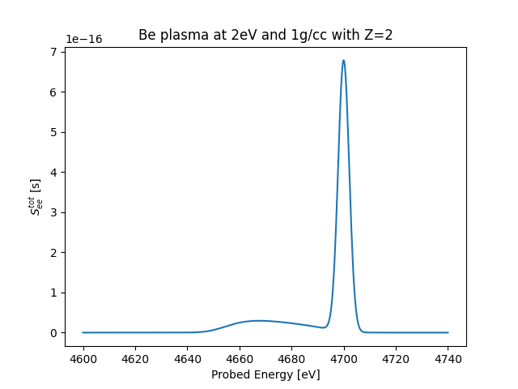

# JaXRTS

**Python code for x-ray Thomson scattering (XRTS), heavily relying on [jax](https://jax.readthedocs.io/en/latest/index.html).**



## Disclaimer

This module is very much work in progress, and experimental in itself, but also in it's dependencies. These scripts are an attempt to summarize published XRTS theory into code usable to compare to experiments, as the state-of-the art software for this purpose, the Multi-Component Scattering Spectra Code MCSS by Dave Chapman is not freely available.

We would not have been able to write this without the seminal work by D. Chapman, G. Gregori, K. Wünsch and D. O. Gericke. A full bibliography can be found under `doc/source/literature.bib`.

The code was written by Samuel Schumacher and Julian Lütgert in the High Energy Density Group of Dominik Kraus at University Rostock.

## Documentation

The documentation can be found in the `doc` directory. To generate it for yourself, just run

```bash
poetry make html
```

in the `doc` directory, after installing the module.

## Installing

We recommend to install the module using [poetry](https://python-poetry.org/) by calling

```bash
poetry install
```

in the root of this repository.

This will create an virtual environment for the project and install the required dependencies. To execute commands within the virtual environment, prefix them with ``poetry run``.

However, you should also be able to just pip install the module, after cloning it:

```bash
pip install -e .
```

This `-e` flag installs the module in 'edit' mode, i.e., changes you made are available without the need of reinstalling the package.

## Getting started

The `jaxrts` module provides a user with two classes, a `Setup` and a `PlasmaState`
While the former specifies the probing energy and measurement grid, scattering angle and instrument function, the latter is defines the state to be probed, and allows for adding `Models` as keys to the plasma state.
To calculate a spectrum, use the `PlasmaState.probe()` method.

A simple example (which generated the figure above) can be found at `doc/examples/plot_getting_started.py`. More examples can be found in the `doc/example` directory.

To get an overview over all the models available, we recommend building the documentation and opening `doc/build/html/models.html`. This page should list all the available model keys and the models with are allowed.
