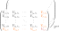

Hypernetted Chain
=================

Within the HNC modules, all quantities have three axis with :math:`(n\times n
\times m)` entries, where :math:`n` is the number of ion species considered and
:math:`m` is the number of :math:`r` or :math:`k` points considered.

The HNC approach is capable of incorporating electrons, natively, by adding it
as an additional ion species. This is normally achieved by setting
:py:attr:`jaxrts.hnc_potentials.HNCPotential.include_electrons` to ``True``.
This adds one additional entry to the first two dimensions (see figure above).
